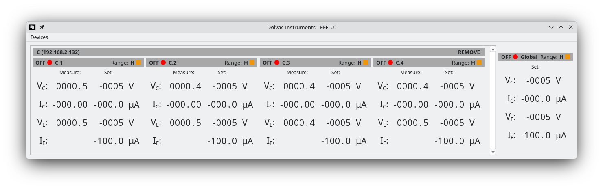
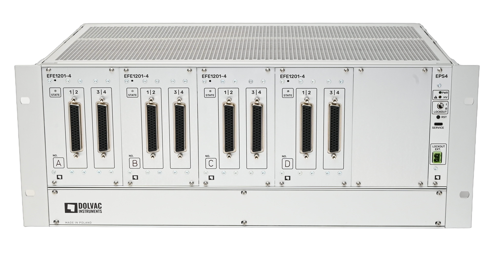

# EFE-UI

Graphical user interface for the EFE1201-4 used in Infascope system.



## EFE1201-4



The EFE1201-4 is a supply and control unit for arrays of field emitters, featuring individual connections for each emitter.
The system supports arrays of size up to 16 channels. The system can operate in diode or triode mode.
The system operates with voltages up to -1200V. Two current ranges of 100 μA and 1 μA allow for reaching full emitter intensity and measurement of turn-on characteristics.

## User manual

For more details read the [user manual](https://manuals.dolvac.com/#/Infascope/EFE-UI)

## Running from the repository

Install [uv](https://docs.astral.sh/uv/getting-started/installation/).

```bash
    git clone https://github.com/dolvacinstruments/efe-ui.git
    cd efe-ui
    uv run src/efe_ui/main.py
```
